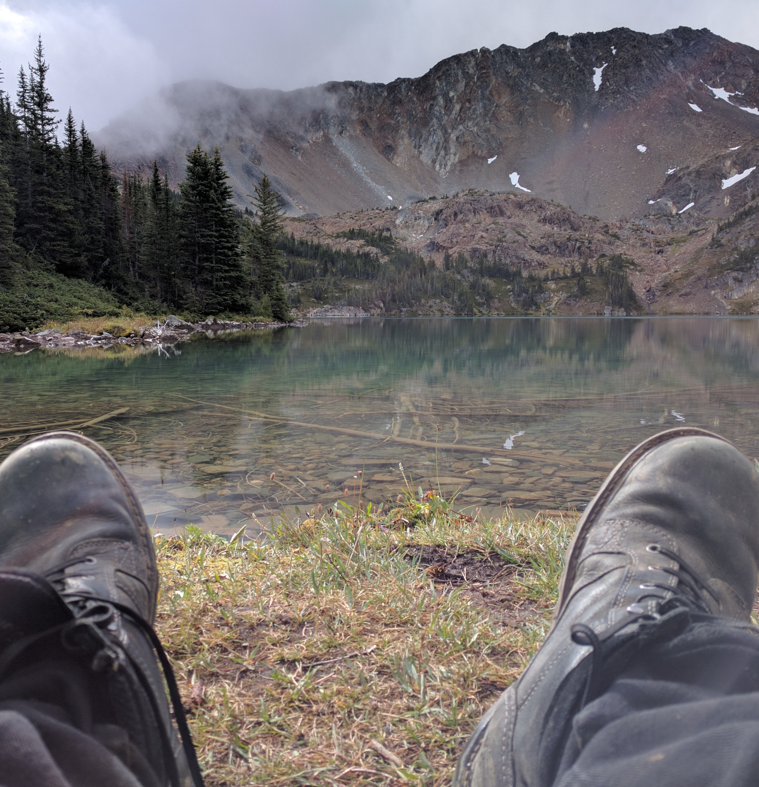

<!-- Main -->

<!-- One -->
<section id="one">
	

		<header class="major">
			<h2>All about jwrg</h2>
		</header>
		

    Greetings!  This page aims to be a short blurb about 
    myself, my interests and fields of expertise.  
    

	

</section>

<!-- Two -->
<section id="two" class="spotlights">
	<section>
		
		

			

				<header class="major">
					<h3>Expertise</h3>
				</header>
				
I have expertise in a number of research fields, and expect to
        publish original research in the future.  Fields in which I am well
        read and have significant expertise include:
        <ul class="alt">
          <li>Cyber risk and cyber law</li>
          <li>Software design, development, and architecture</li>
          <li>Anonymity and the dark web</li>
          <li>Penetration testing and reverse engineering</li>
          <li>Linguistics and computational linguistics</li>
          <li>Graph theory, number theory</li>
        </ul>
        

				<ul class="actions">
					<li><a href="#" class="button">CV Summary</a></li>
				</ul>
			

		

	</section>
	<section>
		
		

			

				<header class="major">
					<h3>Experience</h3>
				</header>
				
I have worked in both cyber risk consulting and systems engineering,
        in both cases entrusted with sensitive materials and high-value, 
        high-tech systems.

				
I have a number of interesting projects both in maintenance and
        development, which are outlined on the projects page.

				<ul class="actions">
					<li><a href="projects.html" class="button">Projects</a></li>
				</ul>
			

		

	</section>
	<section>
		
		

			

				<header class="major">
					<h3>Personal interests</h3>
				</header>
				
I am a big sports fan, particularly hockey and football, and
        having grown up around Pacific Northwest rainforests, am passionate
        about the great outdoors and conservation of said.
        

        
My expertise in linguistics and broad smattering of language
        knowledge is rooted in my esteem for the classics, particularly
        Ancient Greek and Roman literature.  I hope to produce a decent
        volume of translation snippets for the blog.
        

				<ul class="actions">
					<li><a href="all_posts.html" class="button">Read on...</a></li>
				</ul>
			

		

	</section>
</section>

<!-- Three -->
<section id="three">
	

		<header class="major">
			<h2>The Code</h2>
		</header>
		
I've talked myself up as quite a jack-of-all-trades (which I
    am, mind you), but ultimately, I am at the core a software
    engineer (emphasis on engineer, my degree does not say computer
    science on it).  One's writings (code) should speak for oneself.
    

    
 So, if you would like to simply jump right into the code I have made
    public, please check out my GitHub projects directly:

		<ul class="actions">
			<li><a href="https://github.com/jwrg/" class="button next">jwrg on GitHub</a></li>
		</ul>
	

</section>

