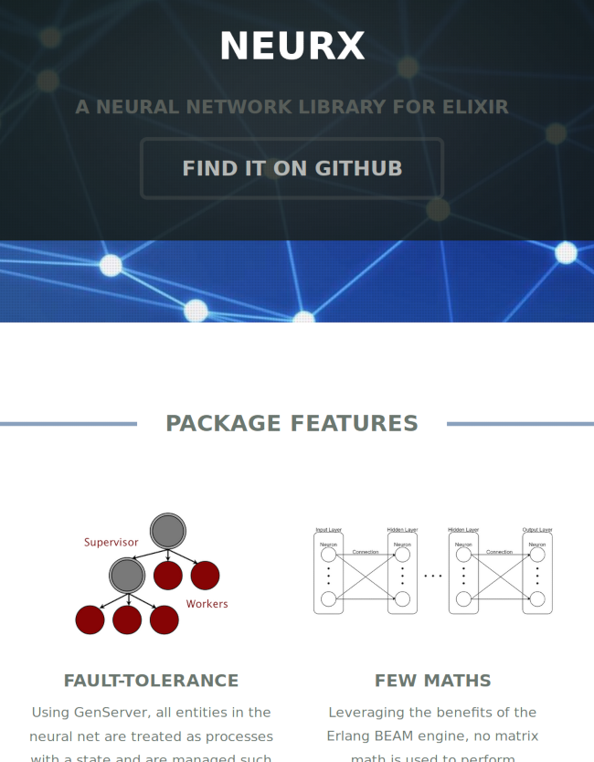
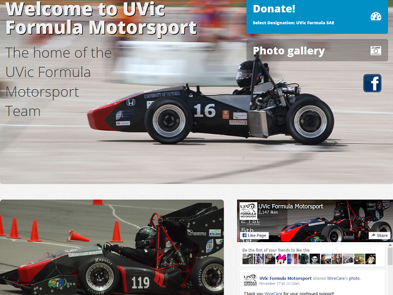

<!-- Main -->

<!-- One -->
<section id="one">
	

		<header class="major">
			<h1>Projects</h1>
		</header>

<!-- Content -->
<h2 id="content">Current Projects</h2>

The following projects are currently ongoing, or at least on the back
burner.

	

    
		<h3>NeurX</h3>
		
<a href="https://neurx.github.io">NeurX</a> is an Elixir 
    library for building and training neural networks.  I am 
    a principal developer and one of the original four developers 
    of NeurX.  Check back for future projects which incorporate NeurX.
    

	

	

    
		<h3>Capiar</h3>
		
<a href="https://github.com/jwrg/capiar">Capiar</a> is a 
    collection of LaTeX classes and macros which I have written 
    and think others may find useful.  Included in the repository 
    are some illuminating examples which make use of said 
    classes and macros.  Examples include cheat sheets, school 
    assignments, a technical resume and cover letter, and a 
    Latin-English dictionary.  
    

	

	<!-- Break -->
	

    
		<h3>Eggsac</h3>
		
<a href="https://github.com/jwrg/eggsac">Eggsac</a> is a 
    concurrent web crawler written in Elixir.  It is currently 
    in the early implementation stages, with a working prototype 
    upcoming soon.
    

	

	

    
		<h3>Greyscale</h3>
		
<a href="#">Greyscale</a> is a security group that meets 
    sporadically to discuss security issues and foster 
    security-focussed software projects.  Founded by myself 
    and <a href="https://vealor.github.io/">Vealor</a>.
    

	

	

    
		<h3>Stimpy</h3>
		
<a href="https://github.com/jwrg/stimpy">Stimpy</a> is 
    a python program for maintaining configuration files and 
    for rapid system provisioning.  It is currently in the 
    late design / early development phase.  A project page 
    is to come soon.
    

	

<h2 id="content">School Projects</h2>

The following projects were performed as part of my studies as a Software
Engineering student at the University of Victoria.

	

    
		<h3>Engineering Design Project: Making BC's Ski Slopes Safer</h3>
		
I led a team that designed a component to be added to ski lift 
    sheave assemblies to mitigate the occurrence of unretained deropements.  
    The design presented won the design competition presided over by the 
    BC Safety Authority in which over 100 teams competed.
    

	

	

    
		<h3>Engineering Design Competition: Autonomous Robotics</h3>
		
Our team designed, assembled, and programmed an autonomous 
    robot using a VEX Robotics kit that accomplished tasks simulating 
    the disposal of hazardous materials.  I served as lead programmer, 
    co-designer and co-constructor on the robotics project.

	

	<!-- Break -->
	

    
		<h3>Software Architecture Project: <strong>OakPlay</strong></h3>
		
The development team was tasked with authoring a web app with 
    functionality to schedule facility bookings for a recreation 
    centre. The team designed and implemented a fully featured 
    system with an innovative grid selection page for scheduling.
    

	

	

    
		<h3>Requirements Engineering Project: <strong>Killer Tech Solutions</strong></h3>
		
The team consulted with a local tech business to learn 
    about requirements engineering techniques that are successful 
    in real-world applications.  Furthermore, the team collected 
    requirements and authored documents on requirements and 
    design which were published on a bespoke project website.
    

	

	

    
		<h3>UVic Formula SAE Motorsports Team: Software Project Lead</h3>
		
Created the initial design of the current website using 
    HTML5 templates.  The design was based on requirements 
    elicited from team leadership.  I also led a requirements
    elicitation effort with regards to a
    development project for a new website/knowledgebase 
    application, to be developed in elixir, which was ultimately
    scrapped owing to resource constraints.
    

	

